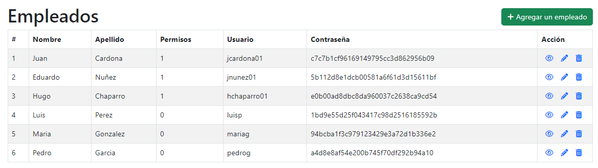
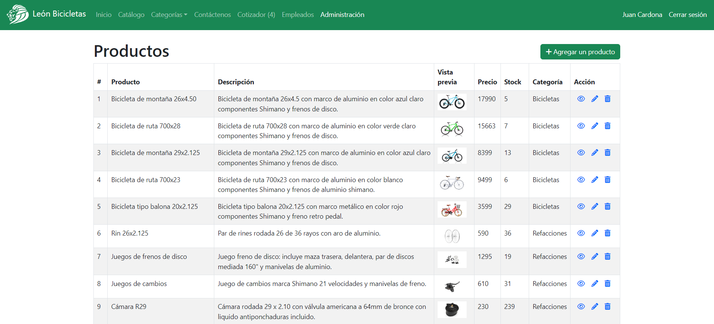

# Backend del Proyecto León Bicicletas

Esta sección se encarga de la lógica y el procesamiento de datos del sitio web de León Bicicletas.

## Características principales

- Conexión a la base de datos MySQL
- Implementación de un sistema de inicio de sesión y permisos de usuario
- Desarrollo de un CRUD (Crear, Leer, Actualizar, Eliminar) para el manejo de productos, clientes, empleados y cotizaciones
- Implementación de procedimientos almacenados y triggers para mantener la integridad de la base de datos

## Estructura de la Base de Datos

### Tabla Empleados

La tabla empleados almacena la información de los empleados de la empresa, incluyendo su nombre, apellido, datos de inicio de sesión y si tienen permisos de administrador.

### Tabla Productos

La tabla productos contiene la información de los productos disponibles en el catálogo de la empresa, como nombre, imagen, descripción, precio y stock.

